<h1 align="center"> 
Hi there 👋. I'm a beginner QA engineer.
</h1>

## 💎 I’m currently have the following skills and knowledges: 
✔️Knowledge of the principles, types and methods of testing;  
✔️Knowledge of test design techniques (Equivalence Partitioning, Boundary Value Analysis, Pairwise Testing, Decision Table Testing);  
✔️Understanding of the software development lifecycle;  
✔️Understanding of software development methodologies (Waterfall, V-model, Scrum, Kanban);  
✔️Creating test documentation (checklists, test cases, bug reports, test reports);  
✔️Testing web and mobile applications;  
✔️Understanding оf client-server architecture;  
✔️Experience in using web development tools (Chrome DevTools);  
✔️API testing using Postman (REST, SOAP);  
✔️Experience of using Charles & Fiddler sniffers;  
✔️Knowledge of SQL;  
✔️Performance testing using JMeter;  
✔️Experience of using Linux-terminal commands.  
_____

<!-- <h1 align="center">📈 My Skill Set and Tools 💻</h1> -->

## 📈 My Skill Set and Tools 💻 

 &nbsp; &nbsp;  &nbsp;&nbsp;
 &nbsp; &nbsp;  &nbsp; &nbsp; 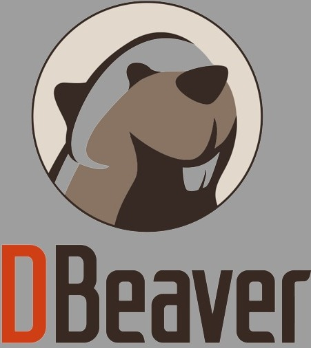 &nbsp; &nbsp; 
 
  &nbsp; &nbsp;  &nbsp; &nbsp;   &nbsp; &nbsp;
 &nbsp; &nbsp;  &nbsp; &nbsp; &nbsp;
<!--  -->

_____

<!-- <h1 align="center">🚀 Technologies 📠 </h1> -->

## 🚀 Technologies 📠
  &nbsp;  &nbsp; &nbsp; 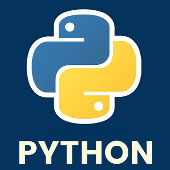 &nbsp;
_____

## 💎 My Codewars ❗

_____
##  My Certificates 💯
<a href="./certificates/Ivan_Nikitenko_Terminal.png">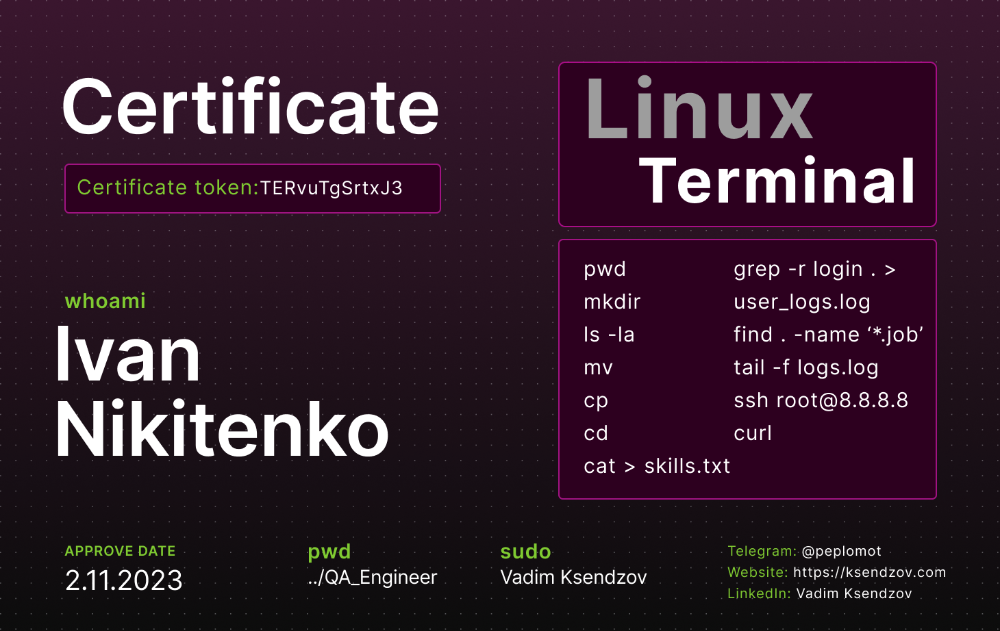</a> &nbsp;
 &nbsp;
<a href="./certificates/Ivan_Nikitenko_SQL.png">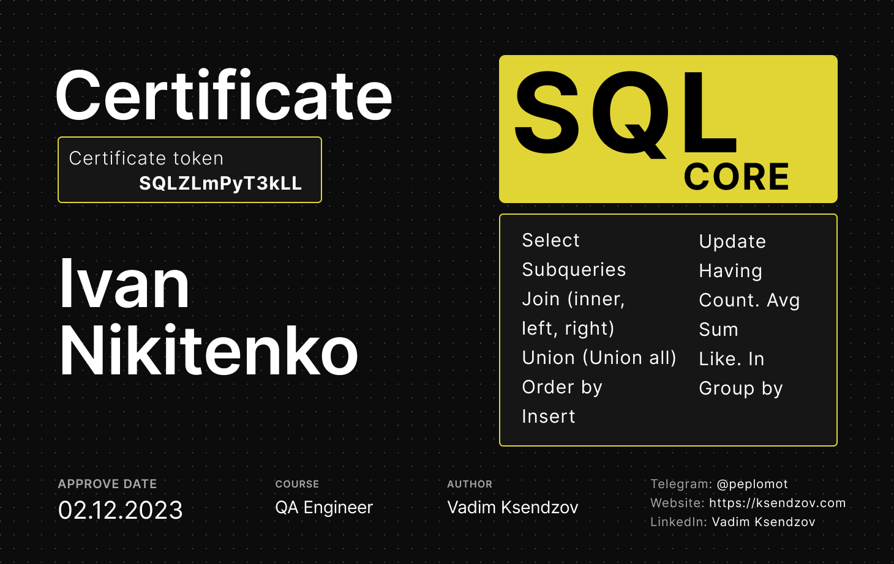</a> &nbsp;
<a href="./certificates/Ivan_Nikitenko_Postman.png">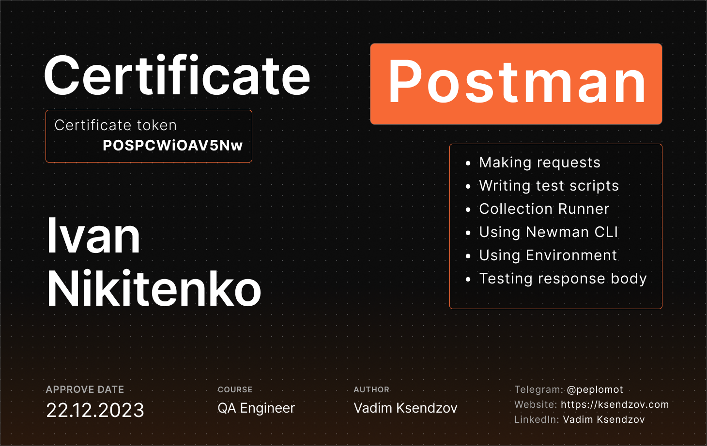</a> 
<a href="./certificates/Ivan_Nikitenko_CSA.png">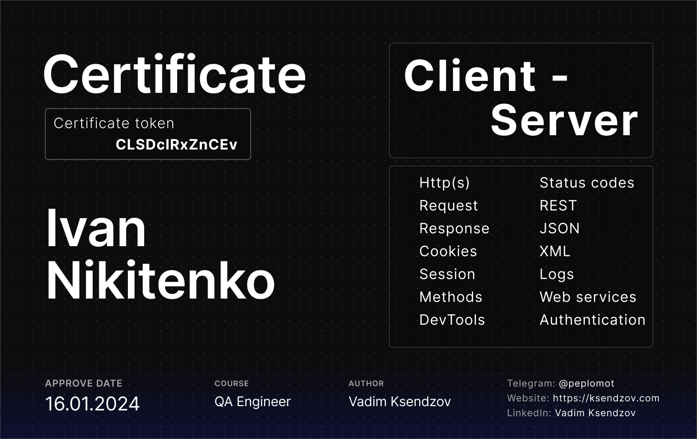</a> &nbsp;
<a href="./certificates/Postman-API-testing-stepik-course.png">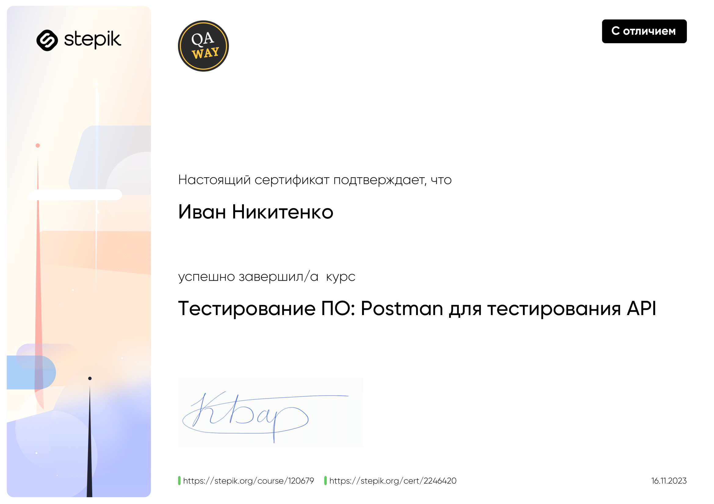</a> &nbsp;
<a href="./certificates/HTML-CSS_stepik-course.png">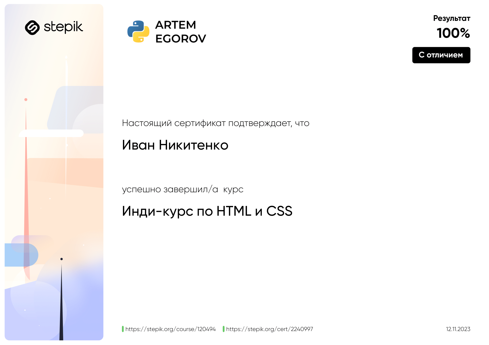</a> &nbsp;
<a href="./certificates/JS-foundation-stepik-cert-wh.png">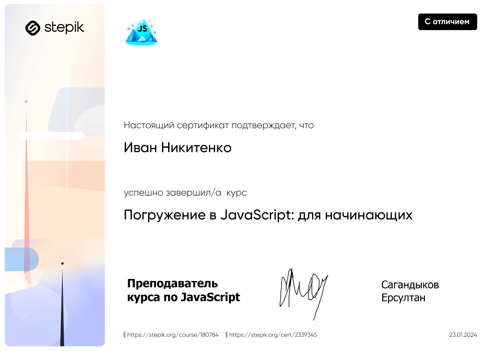</a> 
<a href="./certificates/Python-Generation-stepik-wh.png">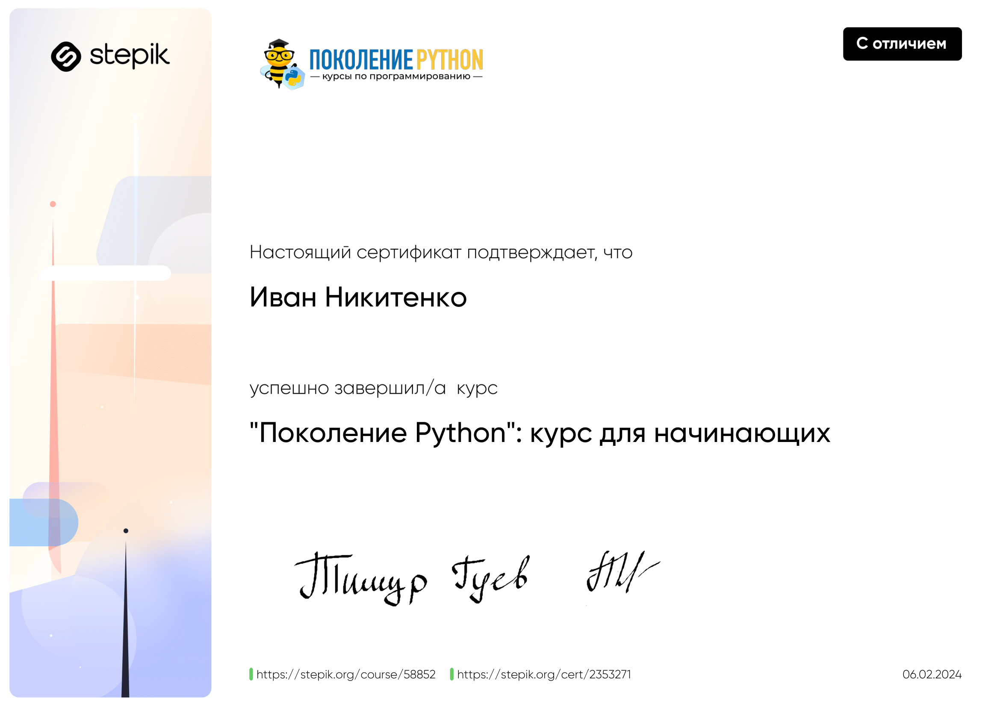</a> &nbsp;
<a href="./certificates/HTML-CSS-JS_stepik-wh.png">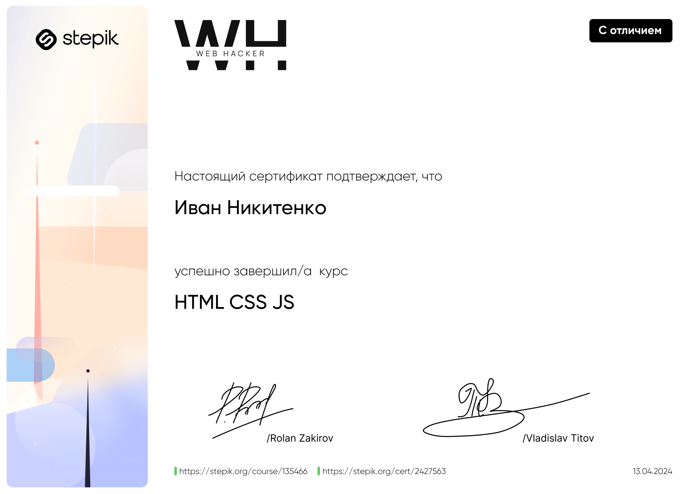</a> &nbsp;
<a href="./certificates/Testing-Universe_stepik-wh.png">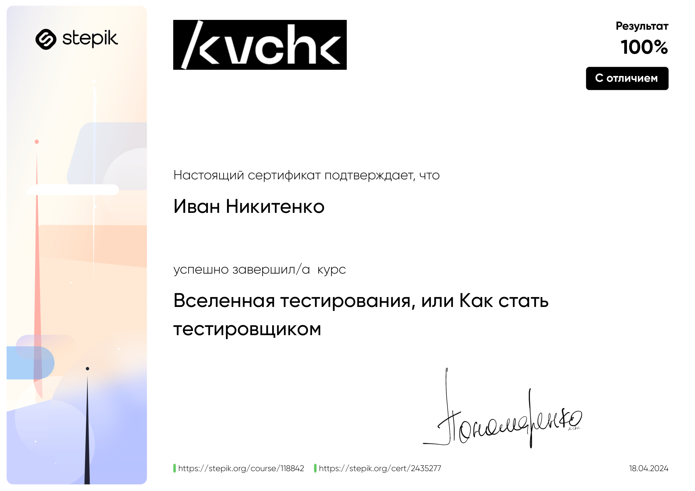</a> &nbsp;
<a href="./certificates/Software-Testing_stepik-wh.png">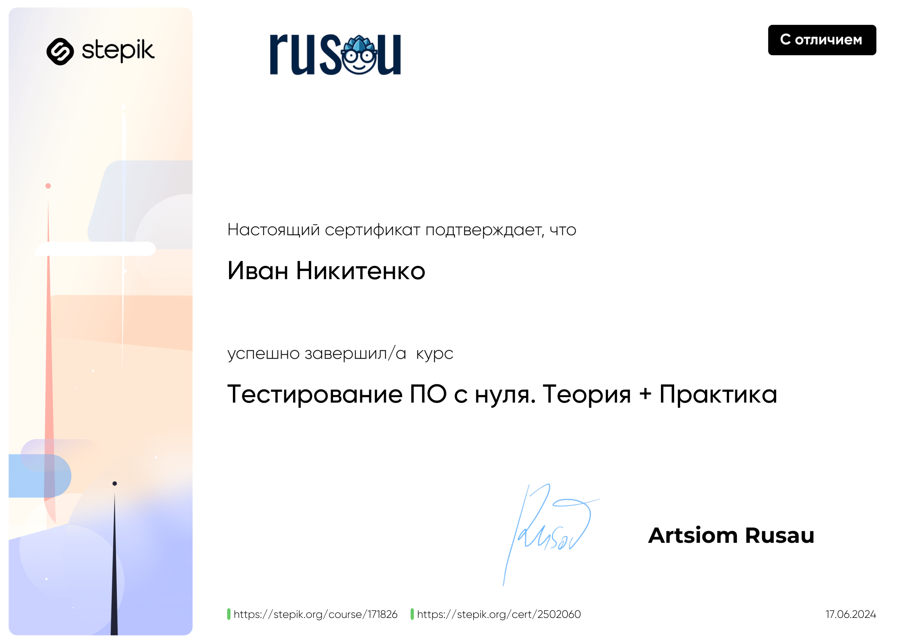</a>
 
_____
## 💬 Contact Me 📞
 &nbsp; 
_____

## 📋 Profile Summary 📊:

 &nbsp; &nbsp; 
<!---->

____

<!--
 <a href="https://www.linkedin.com/in/ivan-nikitenko-qa/" target="_blank" rel="noreferrer"> <picture> <source media="(prefers-color-scheme: dark)" srcset="undefined" /> <source media="(prefers-color-scheme: light)" srcset="https://raw.githubusercontent.com/danielcranney/readme-generator/main/public/icons/socials/linkedin.svg" /> </picture> </a> <a href="https://t.me/man_Ivan" target="_blank" rel="noreferrer">  </picture> </a> 
   -->

<!--
**Ivan-Niki/Ivan-Niki** is a ✨ _special_ ✨ repository because its `README.md` (this file) appears on your GitHub profile.

Here are some ideas to get you started:

- 🔭 I’m currently working on ...
- 🌱 I’m currently learning ...
- 👯 I’m looking to collaborate on ...
- 🤔 I’m looking for help with ...
- 💬 Ask me about ...
- 📫 How to reach me: ...
- 😄 Pronouns: ...
- ⚡ Fun fact: ...
-->
