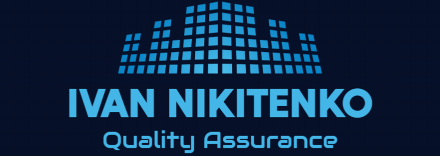
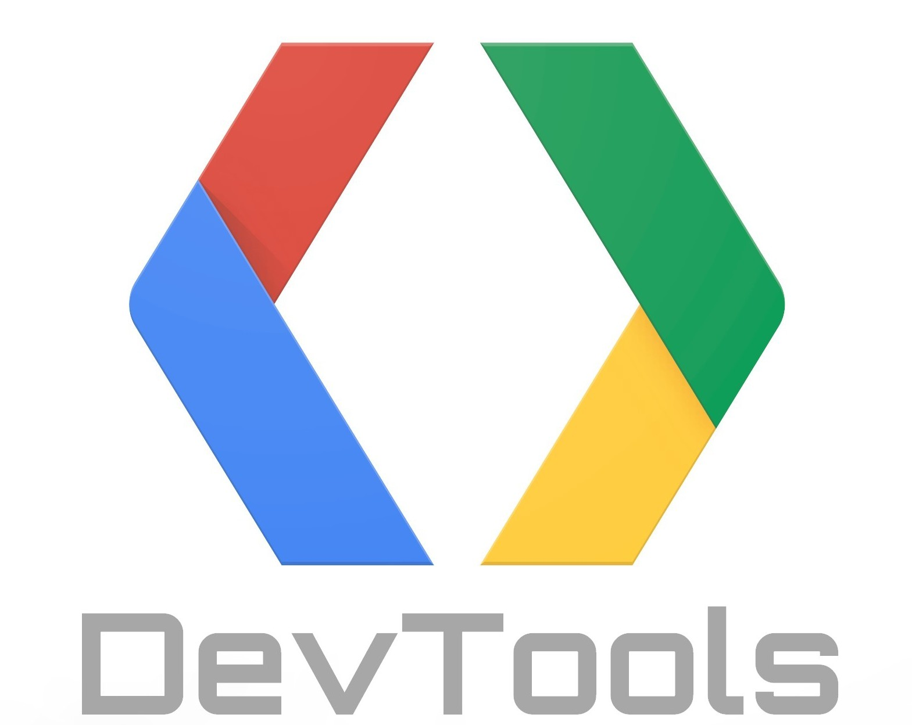

## Hi there 👋. I'm a beginner QA-engineer.

### 📈 My Skills 💻
✅ ✅ ✅   
✅  ✅    
✅  ✅ 
✅
___
### 🚀 Technologies 📠

### 💬 Contact Me 📞

 <a href="https://www.linkedin.com/in/ivan-nikitenko-063162230/" target="_blank" rel="noreferrer"> <picture> <source media="(prefers-color-scheme: dark)" srcset="undefined" /> <source media="(prefers-color-scheme: light)" srcset="https://raw.githubusercontent.com/danielcranney/readme-generator/main/public/icons/socials/linkedin.svg" />  </picture> </a> 
<a href="https://t.me/man_Ivan" target="_blank" rel="noreferrer">  </picture> </a>

<!--
**Ivan-Niki/Ivan-Niki** is a ✨ _special_ ✨ repository because its `README.md` (this file) appears on your GitHub profile.

Here are some ideas to get you started:

- 🔭 I’m currently working on ...
- 🌱 I’m currently learning ...
- 👯 I’m looking to collaborate on ...
- 🤔 I’m looking for help with ...
- 💬 Ask me about ...
- 📫 How to reach me: ...
- 😄 Pronouns: ...
- ⚡ Fun fact: ...
-->
