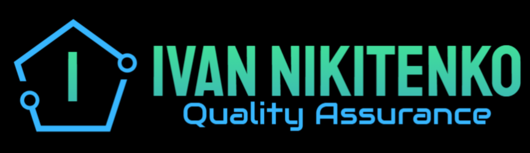
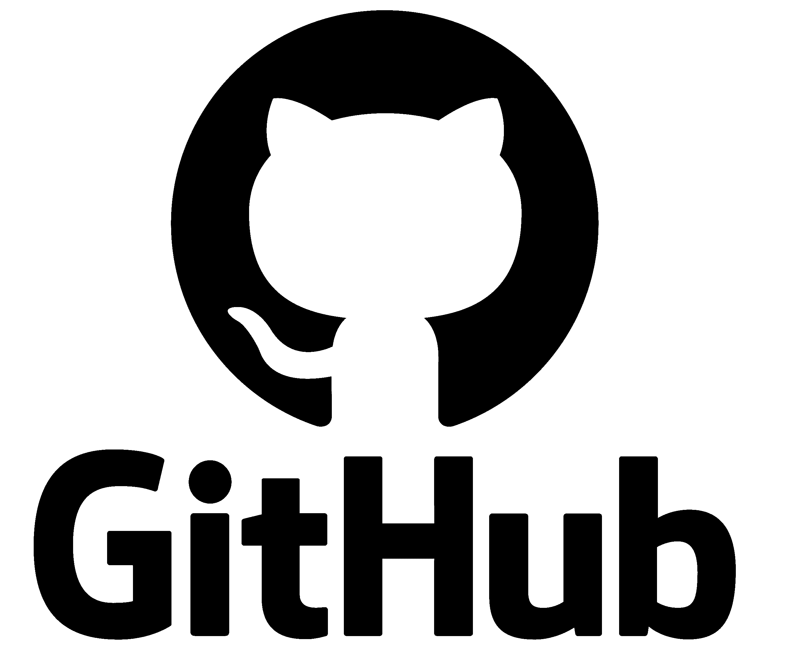
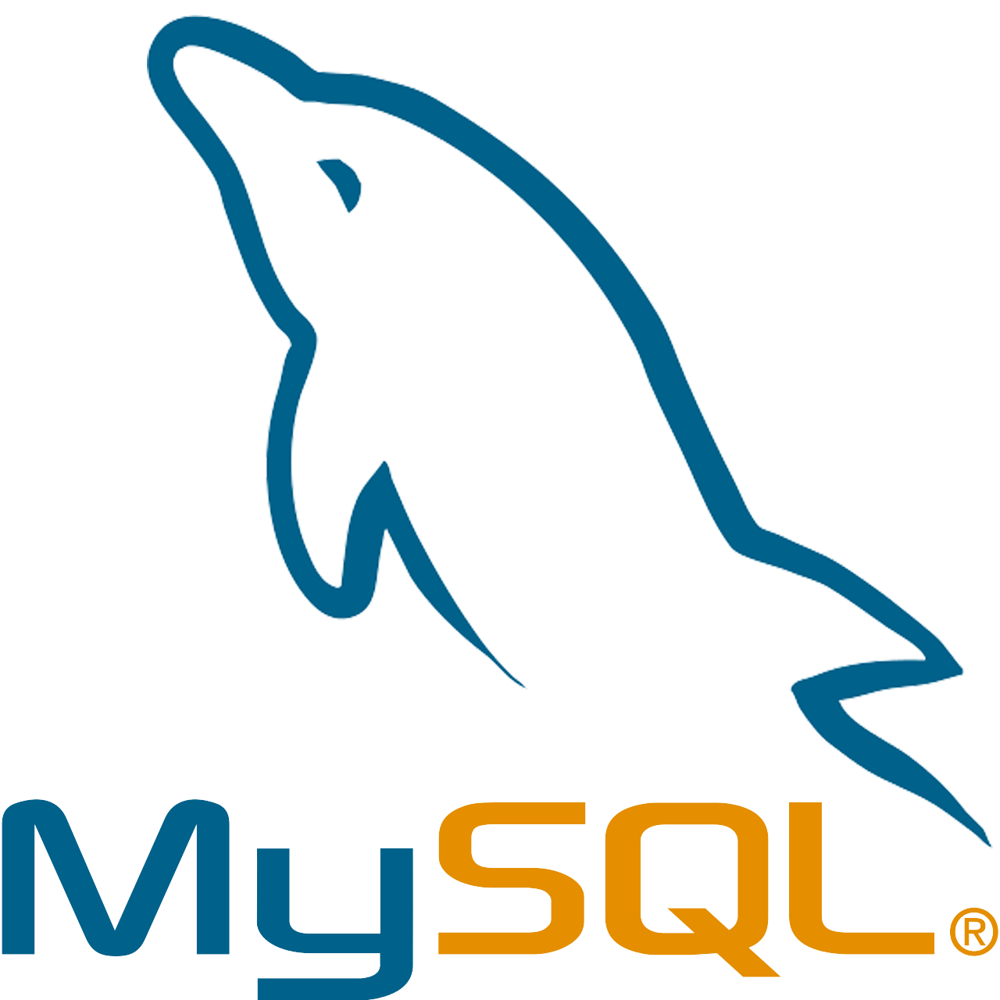
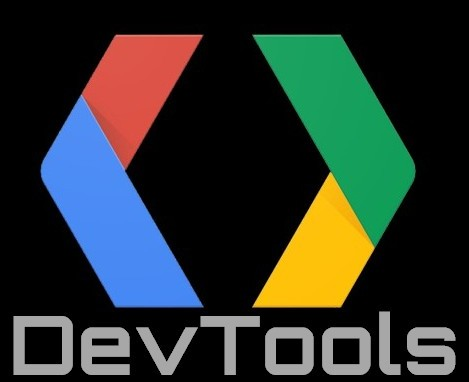
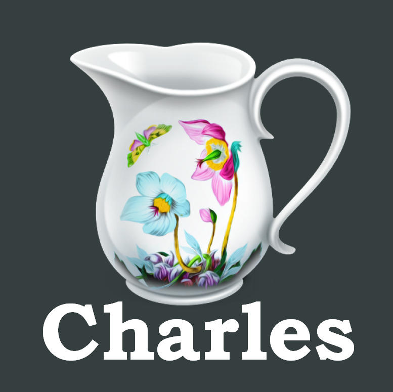
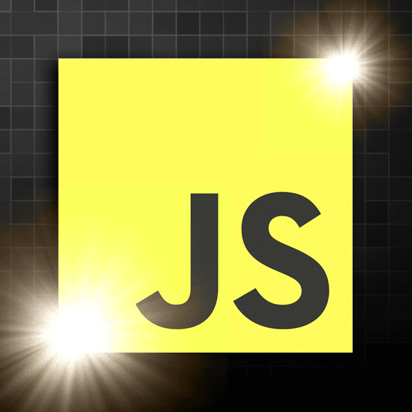
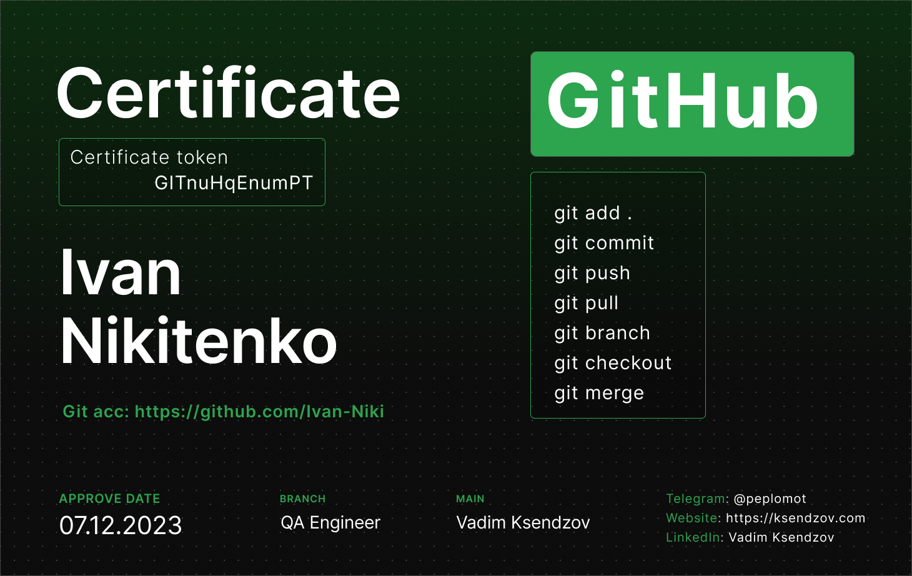

## Hi there 👋. I'm a beginner QA engineer.
### 💎 I’m currently have the following skills and knowledges:
✔️Knowledge of the principles, types and methods of testing;  
✔️Knowledge of test design techniques (Equivalence Partitioning, Boundary Value Analysis, Pairwise Testing, Decision Table Testing);  
✔️Understanding the software development lifecycle;  
✔️Understanding of software development methodologies (Watarfall, V-model, Scrum, Kanban);  
✔️Creating test documentation (checklists, test cases, bug reports, test report);  
✔️Testing web and mobile applications;  
✔️Understanding оf client-server architecture;  
✔️Experience in using web development tools (Chrome DevTools);  
✔️API testing using Postman (REST, SOAP);  
✔️Experience of using Charles & Fiddler sniffers;  
✔️Knowledge of SQL.
____

## 📈 My Skill Set and Tools 💻
     
 &nbsp;     
  &nbsp;  &nbsp;   &nbsp;
 &nbsp;   

_____

## 🚀 Technologies 📠
  &nbsp; 
_____

## 💎 My Codewars ❗

_____

## 📋 Profile Summary 📊:

 &nbsp; &nbsp; 
<!---->

____

## 💬 Contact Me 📞
<!--
 <a href="https://www.linkedin.com/in/ivan-nikitenko-qa/" target="_blank" rel="noreferrer"> <picture> <source media="(prefers-color-scheme: dark)" srcset="undefined" /> <source media="(prefers-color-scheme: light)" srcset="https://raw.githubusercontent.com/danielcranney/readme-generator/main/public/icons/socials/linkedin.svg" /> </picture> </a> <a href="https://t.me/man_Ivan" target="_blank" rel="noreferrer">  </picture> </a> 
   -->
 &nbsp; 

<!--
**Ivan-Niki/Ivan-Niki** is a ✨ _special_ ✨ repository because its `README.md` (this file) appears on your GitHub profile.

Here are some ideas to get you started:

- 🔭 I’m currently working on ...
- 🌱 I’m currently learning ...
- 👯 I’m looking to collaborate on ...
- 🤔 I’m looking for help with ...
- 💬 Ask me about ...
- 📫 How to reach me: ...
- 😄 Pronouns: ...
- ⚡ Fun fact: ...
-->
